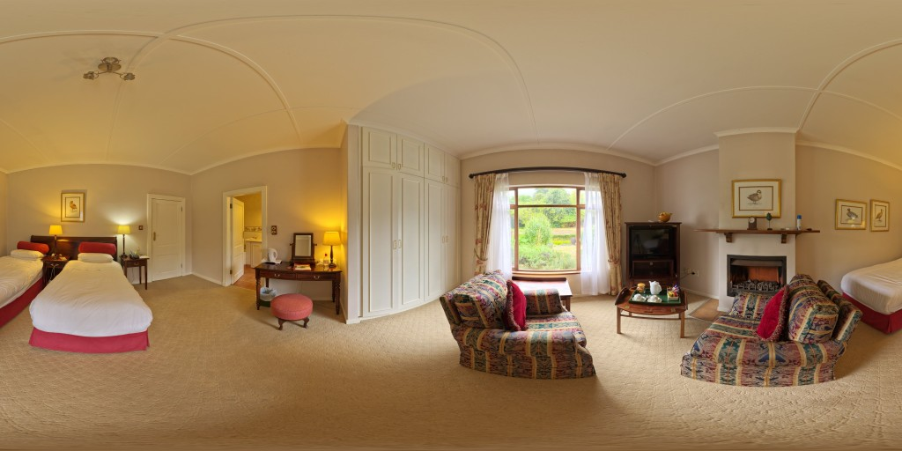
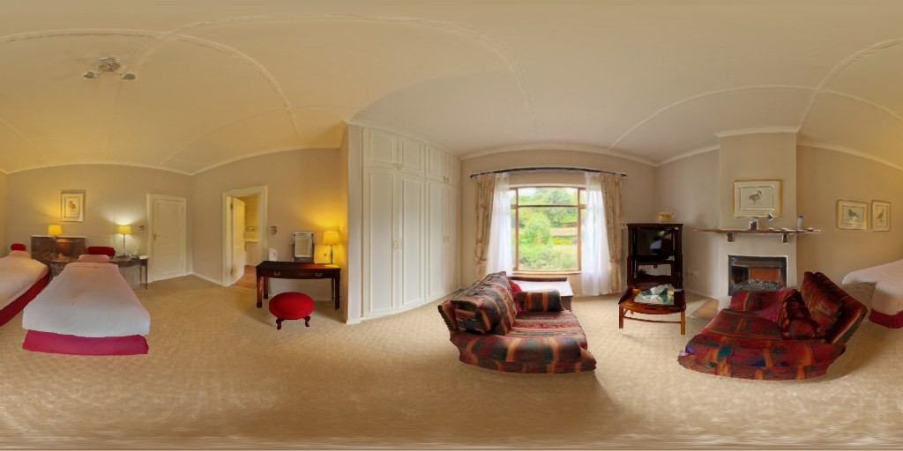
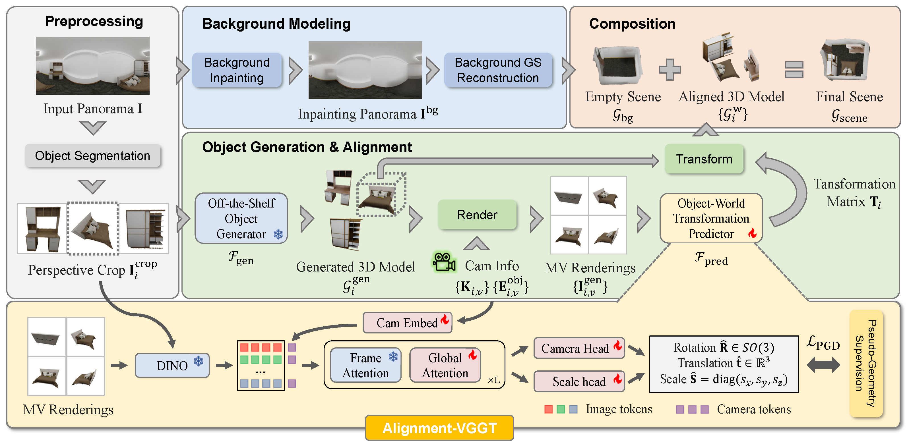

<div align="center">

# Pano3DComposer

### Feed-Forward Compositional 3D Scene Generation from Single Panoramic Image

Zidian Qiu &nbsp;·&nbsp; Ancong Wu<sup>†</sup>

Sun Yat-sen University

**CVPR 2026**

<a href="https://arxiv.org/abs/2603.05908"></a>
<a href="https://qiuzidian.github.io/pano3dcomposer-page/"></a>


 

<sub>Left: input panorama. Right: generated scene (object meshes + background Gaussians).</sub>

</div>

Pano3DComposer turns one or more 360° panoramas of a room into an **editable, metric-scale 3D scene**: every piece of furniture becomes a separate 3D asset, placed in the room by a feed-forward object-to-world predictor (Alignment-VGGT), and the empty room is reconstructed as 3D Gaussians.

- **Feed-forward layout**: one network pass predicts the rotation, translation and anisotropic scale of every object.
- **Plug-and-play generators**: Amodal3R by default, TRELLIS supported.
- **Panorama-native**: seam-aware Depth Anything 3, a panorama-tuned LaMa and GS-DPT background Gaussians.
- **Coarse-to-fine refinement** with an upright prior; optional contact resolution.
- **Any number of views**: beyond the single-panorama setting of the paper, this release also takes several panoramas of one room and aligns every object against all of its observations.

## Method

<div align="center">

</div>

## Installation

Tested on Linux with Python 3.10, PyTorch 2.4.0 + CUDA 12.1 and an NVIDIA H100. Any GPU with 24 GB or more should work. `--low-vram` keeps idle models on the CPU.

```bash
conda create -n pano3d python=3.10 -y && conda activate pano3d
pip install torch==2.4.0 torchvision==0.19.0 --index-url https://download.pytorch.org/whl/cu121
pip install xformers==0.0.27.post2 --index-url https://download.pytorch.org/whl/cu121
pip install -r requirements.txt

# CUDA extensions (nvcc must match the CUDA version of PyTorch)
pip install --no-build-isolation git+https://github.com/NVlabs/nvdiffrast.git
pip install gsplat==1.4.0 --index-url https://docs.gsplat.studio/whl/pt24cu121
pip install --no-build-isolation git+https://github.com/ashawkey/diff-gaussian-rasterization
pip install --no-build-isolation "git+https://github.com/facebookresearch/pytorch3d.git@stable"
pip install torch-scatter -f https://data.pyg.org/whl/torch-2.4.0+cu121.html
pip install spconv-cu120
pip install kaolin==0.17.0 -f https://nvidia-kaolin.s3.us-east-2.amazonaws.com/torch-2.4.0_cu121.html

# Depth Anything 3 (model code only)
pip install --no-deps git+https://github.com/ByteDance-Seed/Depth-Anything-3.git
```

<details>
<summary>Notes</summary>

- [`third_party/amodal3r`](third_party/amodal3r) vendors Amodal3R with small changes, listed in its README.
- [`third_party/omnivggt`](third_party/omnivggt) vendors OmniVGGT with the added anisotropic scale head.
- Attention runs on xFormers by default. Set `ATTN_BACKEND=flash-attn` if flash-attn is installed.
- For `--generator trellis`, install [TRELLIS](https://github.com/microsoft/TRELLIS) so that `import trellis` works.

</details>

## Model weights

Download the packed weights (6.4 GB) into `checkpoints/`:

```bash
huggingface-cli download AutumnSonsweet/Pano3DComposer pano3d.safetensors --local-dir checkpoints
```

The Amodal3R (or TRELLIS) weights are downloaded from Hugging Face on first use.

## Usage

The input is a scene folder with panoramas and one binary mask per object instance. Masks can come from any instance segmenter; `scripts/segment_panorama.py` prompts SAM 2 with one box per object (the demo masks were made this way).

### Single panorama

```
demo/lythwood_room/
├── panoramas/lythwood_room.jpg          # equirectangular, 2:1
└── masks/lythwood_room/                 # one folder per panorama
    ├── bed_1.png
    ├── bed_2.png                        # an object may wrap around the left/right seam
    └── ...
```

```bash
python scripts/infer.py --scene demo/lythwood_room --out outputs/lythwood_room
```

| Output | Content |
|--------|---------|
| `objects/<instance>.glb`, `.ply` | Placed textured mesh and Gaussians of every object |
| `scene_objects.glb` | All objects in one file |
| `background.ply`, `scene.ply` | Background and full-scene Gaussians |
| `render_panorama.png`, `depth_0.png`, `inpainted_0.png` | Previews |
| `transforms.json` | Local-to-world transform of every object, with the intermediate stages |
| `process/` | Intermediate results of every stage (with `--save-process`) |

### Multiple panoramas

Put several panoramas of the same room in `panoramas/` and give each object **the same mask file name in every view where it is visible**:

```
my_room/
├── panoramas/
│   ├── view_a.jpg
│   └── view_b.jpg
├── masks/
│   ├── view_a/{sofa,armchair,coffee_table}.png
│   └── view_b/{sofa,coffee_table,bookshelf}.png   # sofa and coffee_table are seen twice
└── poses.json                                      # optional: {"view_a": 4x4, "view_b": 4x4}
```

```bash
python scripts/infer.py --scene my_room --out outputs/my_room
```

Every object is aligned against all of its observations at once, and the aligned object meshes (`objects/<instance>.glb`, `scene_objects.glb`) and `transforms.json` are exported. `poses.json` gives panorama-to-world poses (world z up); without it, the relative panorama poses are predicted by Depth Anything 3.

The world frame is z-up (gravity along −z), with the first panorama at the origin. `.ply` files and `transforms.json` use this frame directly; `.glb` files are rotated to the y-up glTF convention.

### Options

| Flag | Effect |
|------|--------|
| `--pose-fusion weighted` | Fuse all crop × rendering pose candidates by consistency-weighted SE(3) averaging |
| `--no-refine` | Disable the coarse-to-fine refiner |
| `--no-upright` | Disable the upright prior |
| `--physics` | Resolve collisions and snap floating objects |
| `--generator trellis` | Use TRELLIS instead of Amodal3R |
| `--background on\|off` | Force the background branch on or off (default: only for a single panorama) |
| `--save-process` | Dump the intermediate results of every stage |
| `--low-vram` | Keep idle models on the CPU |

## Demo data

`demo/lythwood_room` is the CC0 panorama [Lythwood Room](https://polyhaven.com/a/lythwood_room) from Poly Haven, with SAM 2 masks of its furniture.

## License

The code of this repository is released under the [MIT License](LICENSE). The vendored third-party code keeps its own license: [OmniVGGT](third_party/omnivggt/LICENSE) (MIT) and [Amodal3R](third_party/amodal3r/LICENSE.txt) (S-Lab License 1.0, non-commercial).

## Citation

```bibtex
@inproceedings{qiu2026pano3dcomposer,
  title     = {Pano3DComposer: Feed-Forward Compositional 3D Scene Generation from Single Panoramic Image},
  author    = {Qiu, Zidian and Wu, Ancong},
  booktitle = {Proceedings of the IEEE/CVF Conference on Computer Vision and Pattern Recognition (CVPR)},
  year      = {2026}
}
```

## Acknowledgements

This project builds on
[VGGT](https://github.com/facebookresearch/vggt),
[OmniVGGT](https://github.com/Livioni/OmniVGGT-official),
[Depth Anything 3](https://github.com/ByteDance-Seed/Depth-Anything-3),
[Amodal3R](https://github.com/Sm0kyWu/Amodal3R),
[TRELLIS](https://github.com/microsoft/TRELLIS),
[LaMa](https://github.com/advimman/lama),
[SAM 2](https://github.com/facebookresearch/sam2) and
[gsplat](https://github.com/nerfstudio-project/gsplat).
We thank the authors for releasing their code.
